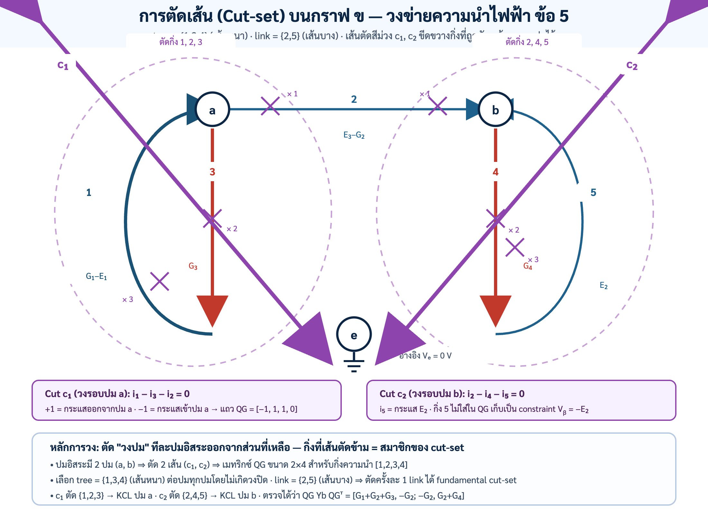

# เฉลยฉบับสอนจนเข้าใจ — ข้อที่ 5: Conductance Network & Directed Graph

> วิชา 303212 การวิเคราะห์วงจรไฟฟ้า 2 · ปมหลัก $a,b$ · ปมอ้างอิง $e$ โดย $V_e=0$
>
> เป้าหมาย: เปลี่ยนวงจรเป็นกราฟ สร้าง incidence/cut-set matrix เขียน KCL โดยไม่ข้ามขั้น และตอบสอบปากเปล่าได้ด้วยเหตุผล

**ไฟล์ประกอบ:** [แดชบอร์ด](interactive_dashboard.html) · [Python](solve_circuit.py) · [MATLAB](solve_circuit.m) · [โจทย์](../oral_exam_problem.md)

---

## บทที่ 0 — คำตอบปลายทางและคำเตือนเรื่องเครื่องหมาย

กิ่งตามทิศอ้างอิงในรูป:

1. $e\to a$: $G_1$ อนุกรม $E_1$, $i_1=G_1(E_1-V_a)$
2. $a\to b$: $E_3$ อนุกรม $G_2$, $i_2=G_2(V_a-E_3-V_b)$
3. $a\to e$: $G_3$, $i_3=G_3V_a$
4. $b\to e$: $G_4$, $i_4=G_4V_b$
5. $b\to e$: $E_2$ โดยขั้วลบอยู่ที่ $b$, จึง $V_b=-E_2$

ดังนั้น

$$\boxed{V_b=-E_2}$$

$$\boxed{V_a=\frac{G_1E_1+G_2E_3-G_2E_2}{G_1+G_2+G_3}}$$

> **บันทึกความสอดคล้องที่สำคัญ:** ข้อความกำกับงานระบุทั้ง
> $i_2=G_2(V_a-E_3-V_b)$ และผลจัดรูป RHS เป็น $G_1E_1-G_2E_3$ ซึ่งอยู่ร่วมกันไม่ได้ทางพีชคณิต
> เมื่อกระจาย $-G_2(V_a-(V_b+E_3))$ จะเกิด **$+G_2E_3$ ทางซ้าย** และเมื่อย้ายขวาจึงเป็น **$+G_2E_3$ ใน RHS** ตามการนิยาม $i_2$ ข้างต้น
> เอกสารนี้ยึดสมการองค์ประกอบและขั้วในรูปเป็นหลัก พร้อมให้สคริปต์ตรวจ KCL; ถ้ากลับขั้ว $E_3$ ให้แทน $E_3\mapsto-E_3$ แล้วเครื่องหมายจะกลับทันที

---

# บทที่ 1 — จากวงจรจริงสู่ Directed Graph และ Incidence Matrix

## 1.1 กราฟคือ “โครงกระดูก” ของวงจร

ให้จินตนาการว่าปมเป็น **สถานี** และกิ่งเป็น **ถนน** เราถอดรูปร่างอุปกรณ์ออกชั่วคราว แต่ยังเก็บว่าอะไรเชื่อมปมใด ทิศลูกศรเป็นเพียง **ทิศอ้างอิงสำหรับนับเครื่องหมาย** ไม่ใช่คำประกาศว่ากระแสจริงต้องไหลทิศนั้น ถ้าคำนวณได้กระแสติดลบ กระแสจริงไหลสวนลูกศรเท่านั้น

| กิ่ง | จาก → ไป | องค์ประกอบ | สมการกระแสตามลูกศร |
|---:|:---:|:---|:---|
|1|$e\to a$|$G_1-E_1$|$i_1=G_1(E_1-V_a)$|
|2|$a\to b$|$E_3-G_2$|$i_2=G_2(V_a-E_3-V_b)$|
|3|$a\to e$|$G_3$|$i_3=G_3V_a$|
|4|$b\to e$|$G_4$|$i_4=G_4V_b$|
|5|$b\to e$|$E_2$|$V_b=-E_2$; กระแสหาโดย KCL|

## 1.2 กติกาเครื่องหมายของเมทริกซ์อุบัติการณ์

เลือกกติกาเดียวแล้วใช้ตลอด:

- $+1$: ลูกศร **ออกจาก** ปมของแถวนั้น
- $-1$: ลูกศร **เข้าสู่** ปมของแถวนั้น
- $0$: กิ่งไม่แตะปมนั้น

เรียงคอลัมน์ $[1,2,3,4,5]$ และเรียงแถว $[a,b,e]$:

$$
[A_a]=
\begin{bmatrix}
-1&+1&+1&0&0\\
0&-1&0&+1&+1\\
+1&0&-1&-1&-1
\end{bmatrix}.
$$

อ่านคอลัมน์ 1: กิ่ง 1 ชี้ $e\to a$ จึงออกจาก $e$ เป็น $+1$ และเข้าสู่ $a$ เป็น $-1$ ผลรวมคอลัมน์เท่ากับศูนย์ สมาชิกทุกคอลัมน์ต้องรวมเป็นศูนย์ เพราะทุกกิ่งมีต้นทางหนึ่งและปลายทางหนึ่ง

ตัดแถวปมอ้างอิง $e$ ออก ได้ reduced incidence matrix

$$
[A]=
\begin{bmatrix}
-1&+1&+1&0&0\\
0&-1&0&+1&+1
\end{bmatrix}.
$$

สองแถวเป็นอิสระ เพราะ KCL ของปม $e$ เท่ากับลบผลรวม KCL ที่ $a,b$ อยู่แล้ว นี่คือเหตุผลว่ากราฟต่อเนื่อง $n=3$ ปม มีสมการ KCL อิสระ $n-1=2$ สมการ

## 1.3 จาก incidence สู่ cut-set

ถ้าเลือก star tree ที่มี twig เชื่อมปมไม่อ้างอิงกับ $e$ เราจะได้ตัวแปร twig voltage เท่ากับ node voltage โดยตรง กล่าวคือ $\mathbf V_n=[V_a,V_b]^T$ และ fundamental cut-set matrix ลดรูปเป็น reduced incidence matrix หลังจัดทิศ/คอลัมน์ให้สอดคล้อง นี่คือสะพานเชื่อมว่า **nodal analysis เป็นกรณีพิเศษของ cut-set analysis**

---

# บทที่ 2 — KCL และสมการชุดตัดแบบ Zero Mathematical Gaps

## 2.1 KCL ที่ปม $a$

กระแสกิ่ง 1 ไหล **เข้า** $a$ ตามลูกศร ส่วนกิ่ง 2 และ 3 ไหล **ออก** $a$:

$$i_1-i_3-i_2=0$$

แทนสมการองค์ประกอบทีละตัว:

$$G_1(E_1-V_a)-G_3V_a-G_2(V_a-E_3-V_b)=0$$

กระจายวงเล็บ $G_1$:

$$G_1E_1-G_1V_a-G_3V_a-G_2(V_a-E_3-V_b)=0$$

กระจายวงเล็บ $-G_2$ ครบทั้งสามพจน์:

$$G_1E_1-G_1V_a-G_3V_a-G_2V_a+G_2E_3+G_2V_b=0$$

ย้ายพจน์แรงดันปมไปขวาก่อน:

$$G_1E_1+G_2E_3=G_1V_a+G_3V_a+G_2V_a-G_2V_b$$

สลับซ้าย–ขวา:

$$G_1V_a+G_2V_a+G_3V_a-G_2V_b=G_1E_1+G_2E_3$$

ดึง $V_a$ เป็นตัวประกอบ:

$$\boxed{(G_1+G_2+G_3)V_a-G_2V_b=G_1E_1+G_2E_3} \tag{1}$$

## 2.2 KCL ที่ปม $b$ และกระแสแหล่ง $E_2$

กำหนด $i_{E2}$ ชี้ออกจาก $b$ ลง $e$ กระแสกิ่ง 2 เข้า $b$ ส่วนกิ่ง 4 และ 5 ออก:

$$i_2-i_4-i_{E2}=0$$

แทนสมการ:

$$G_2(V_a-E_3-V_b)-G_4V_b-i_{E2}=0$$

ย้าย $i_{E2}$ ไปขวา:

$$G_2(V_a-E_3-V_b)-G_4V_b=i_{E2}$$

จึง

$$\boxed{i_{E2}=G_2(V_a-E_3-V_b)-G_4V_b} \tag{2}$$

อ่านขั้ว $E_2$: ขั้วบวกอยู่ที่ $e$, ขั้วลบอยู่ที่ $b$:

$$V_e-V_b=E_2$$
$$0-V_b=E_2$$
$$\boxed{V_b=-E_2}. \tag{3}$$

แทน (3) ใน (2):

$$i_{E2}=G_2(V_a-E_3-(-E_2))-G_4(-E_2)$$
$$\boxed{i_{E2}=G_2(V_a-E_3+E_2)+G_4E_2}. \tag{4}$$

## 2.3 แก้แรงดันปม

แทน $V_b=-E_2$ ใน (1):

$$(G_1+G_2+G_3)V_a-G_2(-E_2)=G_1E_1+G_2E_3$$

ลบจำนวนลบเป็นบวก:

$$(G_1+G_2+G_3)V_a+G_2E_2=G_1E_1+G_2E_3$$

ลบ $G_2E_2$ ทั้งสองข้าง:

$$(G_1+G_2+G_3)V_a=G_1E_1+G_2E_3-G_2E_2$$

หารด้วย $G_1+G_2+G_3>0$:

$$\boxed{V_a=\frac{G_1E_1+G_2E_3-G_2E_2}{G_1+G_2+G_3}}.$$

## 2.4 สร้าง $[Q_K][Y_b][Q_K]^T$ ทุกสมาชิก

ดูรูปประกอบการตัดเส้นก่อน (เส้นตัดสีม่วง $c_1$ แยกปม $a$ ตัดกิ่ง 1,2,3 และ $c_2$ แยกปม $b$ ตัดกิ่ง 2,4,5):



สำหรับส่วนกิ่งความนำเรียง $[1,2,3,4]$ ใช้ cut/node incidence

$$[Q_G]=\begin{bmatrix}-1&+1&+1&0\\0&-1&0&+1\end{bmatrix},\qquad
[Y_b]=\operatorname{diag}(G_1,G_2,G_3,G_4).$$

คูณ $Q_GY_b$:

$$Q_GY_b=\begin{bmatrix}-G_1&G_2&G_3&0\\0&-G_2&0&G_4\end{bmatrix}.$$

คำนวณสมาชิก $(1,1)$ จาก row 1 dot row 1 แบบถ่วงความนำ:

$$M_{11}=(-1)^2G_1+(+1)^2G_2+(+1)^2G_3+0^2G_4=G_1+G_2+G_3.$$

สมาชิก $(1,2)$:

$$M_{12}=(-1)(0)G_1+(+1)(-1)G_2+(+1)(0)G_3+(0)(+1)G_4=-G_2.$$

สมาชิก $(2,1)$:

$$M_{21}=(0)(-1)G_1+(-1)(+1)G_2+(0)(+1)G_3+(+1)(0)G_4=-G_2.$$

สมาชิก $(2,2)$:

$$M_{22}=0^2G_1+(-1)^2G_2+0^2G_3+(+1)^2G_4=G_2+G_4.$$

จึง

$$\boxed{Q_GY_bQ_G^T=\begin{bmatrix}G_1+G_2+G_3&-G_2\\-G_2&G_2+G_4\end{bmatrix}}.$$

เมทริกซ์นี้สมมาตร แต่แหล่งแรงดันอุดมคติไม่สามารถ “ยัดเป็น conductance จำกัด” ใน $Y_b$ ได้อย่างซื่อตรง จึงต้องใส่ constraint $V_b=-E_2$ และกระแส $i_{E2}$ เป็นตัวตอบสนอง สมการที่เหมาะกับการแก้จริงคือ

$$
\underbrace{\begin{bmatrix}G_1+G_2+G_3&-G_2\\0&1\end{bmatrix}}_{\mathbf A}
\underbrace{\begin{bmatrix}V_a\\V_b\end{bmatrix}}_{\mathbf x}
=
\underbrace{\begin{bmatrix}G_1E_1+G_2E_3\\-E_2\end{bmatrix}}_{\mathbf b}.
$$

---

# บทที่ 3 — คำนวณด้วยมือ ทศนิยม 6 ตำแหน่ง

กำหนดตัวอย่าง

$$G_1=0.400000,\quad G_2=0.300000,\quad G_3=0.200000,\quad G_4=0.500000\ \mho$$
$$E_1=12.000000,\quad E_2=6.000000,\quad E_3=2.000000\ \mathrm V.$$

> หมายเหตุ: อักขระว่างพิเศษในบรรทัดบนมีไว้คั่นสายตา; ค่าเลขคือ 0.4, 0.3, 0.2, 0.5 และ 12, 6, 2 ตามลำดับ

**หา $V_b$**

$$V_b=-E_2=-6.000000\ \mathrm V.$$

**ตัวส่วนของ $V_a$**

$$G_1+G_2+G_3=0.400000+0.300000+0.200000$$
$$=0.700000+0.200000$$
$$=0.900000\ \mho.$$

**ตัวเศษ**

$$G_1E_1=0.400000\times12.000000=4.800000\ \mathrm A$$
$$G_2E_3=0.300000\times2.000000=0.600000\ \mathrm A$$
$$G_2E_2=0.300000\times6.000000=1.800000\ \mathrm A$$
$$4.800000+0.600000-1.800000=5.400000-1.800000=3.600000\ \mathrm A.$$

**หาร**

$$V_a=\frac{3.600000}{0.900000}=\boxed{4.000000\ \mathrm V}.$$

**กระแสทุกกิ่ง**

$$i_1=0.400000(12.000000-4.000000)=0.400000(8.000000)=3.200000\ \mathrm A$$
$$i_2=0.300000(4.000000-2.000000-(-6.000000))=0.300000(8.000000)=2.400000\ \mathrm A$$
$$i_3=0.200000(4.000000)=0.800000\ \mathrm A$$
$$i_4=0.500000(-6.000000)=-3.000000\ \mathrm A$$
$$i_{E2}=i_2-i_4=2.400000-(-3.000000)=5.400000\ \mathrm A.$$

ตรวจ KCL ปม $a$:

$$i_1-i_3-i_2=3.200000-0.800000-2.400000=0.000000\ \mathrm A\quad\checkmark$$

ตรวจ KCL ปม $b$:

$$i_2-i_4-i_{E2}=2.400000-(-3.000000)-5.400000=0.000000\ \mathrm A\quad\checkmark$$

---

# บทที่ 4 — Computer Solver และการตรวจไขว้

Python และ MATLAB ตั้ง $\mathbf A\mathbf x=\mathbf b$ โดยตรง สคริปต์ Python ใช้ standard library เท่านั้น และตรวจ 1,000 ชุดสุ่ม

```bash
python3 solve_circuit.py
python3 solve_circuit.py --G1 .4 --G2 .3 --G3 .2 --G4 .5 --E1 12 --E2 6 --E3 2
```

| ปริมาณ | มือ (6 ตำแหน่ง) | Python matrix solver | ผลต่าง |
|---|---:|---:|---:|
|$V_a$|4.000000 V|4.000000000000 V|0|
|$V_b$|-6.000000 V|-6.000000000000 V|0|
|KCL ปม $a$|0.000000 A|ระดับ $10^{-16}$ A|round-off|
|KCL ปม $b$|0.000000 A|0 A|0|

สิ่งที่ต้องตรวจ: ผลรวมคอลัมน์ $A_a$ เป็นศูนย์, $Q_GY_bQ_G^T$ สมมาตร, สูตรปิดตรงกับ solver, KCL ทั้งสองปมเป็นศูนย์ และเมื่อเปลี่ยน $G_4$ แรงดันยังเดิมเพราะ $E_2$ ตรึง $V_b$ แต่ $i_{E2}$ เปลี่ยน

---

# บทที่ 5 — Master Oral Defense 15 ข้อ

## 1) ลูกศรใน directed graph หมายความว่ากระแสจริงต้องไหลตามนั้นหรือไม่?
**🛡️ รอดชีวิต:** “ไม่จำเป็นครับ ลูกศรเป็นทิศอ้างอิงเพื่อกำหนดเครื่องหมาย ถ้าคำตอบกระแสติดลบ แปลว่ากระแสจริงสวนลูกศร”

**🏆 เกียรตินิยม:** “ถ้ากลับลูกศรกิ่งหนึ่ง คอลัมน์นั้นใน incidence/cut-set matrix และตัวแปรกิ่งจะเปลี่ยนเครื่องหมายพร้อมกัน ปริมาณทางกายภาพและแรงดันปมจึงไม่เปลี่ยน นี่คือ orientation invariance ครับ”

## 2) สร้าง complete incidence matrix อย่างไร?
**🛡️:** “หนึ่งแถวต่อปม หนึ่งคอลัมน์ต่อกิ่ง ใส่ +1 ที่ต้นทาง −1 ที่ปลายทาง 0 ถ้าไม่แตะปมครับ”

**🏆:** “ทุกคอลัมน์รวมเป็นศูนย์ จึงมี row dependence หนึ่งตัว สำหรับกราฟต่อเนื่อง rank เท่ากับ $n-1$ ตรงกับจำนวนสมการ KCL อิสระครับ”

## 3) ทำไมต้องลบแถวกราวด์?
**🛡️:** “เพื่อได้ reduced incidence และตัดสมการ KCL ซ้ำซ้อนออกครับ”

**🏆:** “การเลือกกราวด์คือ gauge fixing: แรงดันมีความหมายเฉพาะผลต่าง การตรึง $V_e=0$ กำจัด degree of freedom ที่เลื่อนศักย์ทุกปมพร้อมกันครับ”

## 4) เขียน KCL ปม $a$ จากศูนย์
**🛡️:** “กิ่ง 1 เข้า กิ่ง 2 และ 3 ออก จึง $i_1-i_3-i_2=0$ แล้วแทน $i_1=G_1(E_1-V_a)$, $i_2=G_2(V_a-E_3-V_b)$, $i_3=G_3V_a$ ครับ”

**🏆:** “ผมตรวจเครื่องหมายอีกชั้นด้วย nodal matrix: diagonal ต้องเป็นผลรวม conductance ที่แตะปม คือ $G_1+G_2+G_3$ และ off-diagonal ระหว่าง $a,b$ ต้องเป็น $-G_2$ ครับ”

## 5) ทำไม RHS ของสมการปม $a$ มี $+G_2E_3$?
**🛡️:** “เพราะกระจาย $-G_2(V_a-E_3-V_b)$ ได้ $-G_2V_a+G_2E_3+G_2V_b$ ครับ”

**🏆:** “เครื่องหมายนี้ตรวจได้สามทาง: กระจายวงเล็บ, ตั้ง MNA, และแทนคำตอบกลับ KCL ถ้าใช้เครื่องหมายตรงข้าม residual จะไม่เป็นศูนย์ เว้นแต่เรากลับขั้ว $E_3$ ครับ”

## 6) ทำไม $V_b=-E_2$?
**🛡️:** “ขั้วบวก $E_2$ อยู่ที่กราวด์ ขั้วลบอยู่ที่ $b$: $V_e-V_b=E_2$, แทน $V_e=0$ จึง $V_b=-E_2$ ครับ”

**🏆:** “แหล่งอุดมคติตรึงแรงดัน แต่ไม่ตรึงกระแส กระแส $i_{E2}$ จึงต้องหาเป็น reaction variable จาก KCL ครับ”

## 7) ทำไม $G_4$ ไม่ปรากฏใน $V_a,V_b$?
**🛡️:** “เพราะ $E_2$ ตรึง $V_b$ และ $G_4$ ต่อขนานกับแหล่งนั้น จึงเปลี่ยนกระแสแต่เปลี่ยนแรงดันไม่ได้ครับ”

**🏆:** “ในเชิง sensitivity ได้ $\partial V_a/\partial G_4=\partial V_b/\partial G_4=0$ แต่ $\partial i_{E2}/\partial G_4=E_2$ ตามทิศที่นิยาม จึงเป็นตัวอย่าง ideal voltage clamp ครับ”

## 8) $QYQ^T$ สร้างอย่างไร?
**🛡️:** “$Q$ บอกว่ากิ่งใดตัดผ่าน cut ใดพร้อมเครื่องหมาย ส่วน $Y$ ใส่ conductance บน diagonal แล้วคูณได้ cut/nodal admittance matrix ครับ”

**🏆:** “สมาชิก $M_{ij}=\sum_k q_{ik}G_kq_{jk}$ จึงตีความได้ว่าทุกกิ่ง $k$ สะสม contribution แบบ rank-one $G_kq_kq_k^T$ ครับ”

## 9) ทำไม $QYQ^T$ สมมาตร?
**🛡️:** “เพราะ $Y^T=Y$ และ $(QYQ^T)^T=QYQ^T$ ครับ”

**🏆:** “ถ้า conductance เป็นบวก เมทริกซ์ยัง positive semidefinite เพราะ $x^TQYQ^Tx=(Q^Tx)^TY(Q^Tx)\ge0$; หลังยึด reference และกราฟต่อเนื่องจะ positive definite ในส่วนตัวแปรอิสระครับ”

## 10) ทำไมแหล่งแรงดันไม่ใส่ conductance จำกัดใน $Y_b$?
**🛡️:** “เพราะแหล่งแรงดันอุดมคติไม่มีสมการ $i=Gv$ ด้วย $G$ จำกัด มันบังคับแรงดันและปล่อยกระแสตามวงจรครับ”

**🏆:** “จึงต้องใช้ constraint/MNA เพิ่มกระแสแหล่งเป็นตัวแปร หรือเลือกแหล่งเป็น twig แล้วใช้แรงดัน twig ที่รู้ค่า ไม่ควรแกล้งแทนด้วยเลข conductance ใหญ่มากเพราะทำให้ conditioning แย่ครับ”

## 11) การเลือกต้นไม้ที่มีแหล่งแรงดันช่วยอย่างไร?
**🛡️:** “ทำให้แรงดัน twig หลายตัวเป็นค่าที่รู้แล้ว ลดจำนวนตัวไม่รู้ครับ”

**🏆:** “เป็นการเลือก coordinates ให้ constraint จากแหล่งจ่ายตรงกับแกนตัวแปร จึงลด algebraic coupling; topology ไม่เปลี่ยนคำตอบ แต่เปลี่ยน sparsity และความง่ายของระบบครับ”

## 12) Cut-set กับ KCL ที่ปมต่างกันหรือไม่?
**🛡️:** “KCL ปมเป็น cut ที่ล้อมปมเดียว ส่วน cut-set อาจล้อมหลายปมครับ”

**🏆:** “ทั้งคู่มาจาก conservation of charge เดียวกัน; nodal analysis คือ cut-set analysis ภายใต้ star-tree coordinates ครับ”

## 13) Cut-set กับ loop เป็น dual กันอย่างไร?
**🛡️:** “Cut-set ใช้ KCL/แรงดัน/admittance ส่วน loop ใช้ KVL/กระแส/impedance ครับ”

**🏆:** “cut space ตั้งฉากกับ cycle space และ $QB^T=0$; มิติรวม $(n-1)+(b-n+1)=b$ ทำให้เป็น orthogonal complements และเชื่อมสู่ Tellegen ครับ”

## 14) ตรวจคำตอบอย่างไรให้กรรมการเชื่อ?
**🛡️:** “ตรวจหน่วย แทนกลับ KCL ทั้งสองปม และเทียบกับ matrix solver ครับ”

**🏆:** “ผมเพิ่ม randomized cross-check 1,000 ชุดและตรวจ structural invariants: column sum ของ $A_a$, symmetry ของ $QYQ^T$, orientation consistency และกรณีสุดขั้ว $G_4$ sweep ครับ”

## 15) ถ้ากลับขั้ว $E_3$ จะเกิดอะไร?
**🛡️:** “แทน $E_3$ ด้วย $-E_3$ จึงได้ $V_a=(G_1E_1-G_2E_3-G_2E_2)/(G_1+G_2+G_3)$ ครับ”

**🏆:** “โครงสร้างเมทริกซ์ฝั่งซ้ายไม่เปลี่ยน เพราะ topology/conductance ไม่เปลี่ยน เปลี่ยนเฉพาะ source vector ฝั่งขวา นี่แสดงการแยก topology ออกจาก excitation ชัดเจนครับ”

---

## เช็กลิสต์ก่อนสอบ

- [ ] วาด $A_a$ และ $A$ ได้โดยไม่ดูเฉลย
- [ ] พูดได้ว่าลูกศรเป็น reference ไม่ใช่กระแสจริงเสมอ
- [ ] กระจาย KCL ปม $a$ ได้ทุกบรรทัดและป้องกันเครื่องหมาย $E_3$
- [ ] อธิบาย $V_b=-E_2$ จากขั้ว ไม่ใช่จากการท่องจำ
- [ ] สร้างสมาชิกทั้งสี่ของ $Q_GY_bQ_G^T$ ได้
- [ ] อธิบายว่าทำไม $G_4$ มีผลต่อกระแสแต่ไม่มีผลต่อแรงดัน
- [ ] เชื่อม cut space, loop space และ $QB^T=0$ ได้
- [ ] เปิด Lab แล้วทดลองกลับขั้ว $E_3$ และกวาด $G_4$
