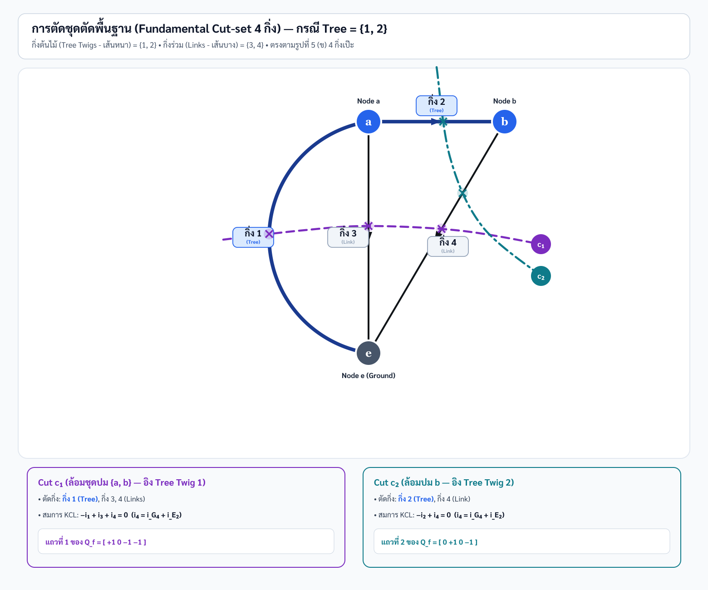

# เฉลยและบทเรียนฉบับสอนจนบรรลุ — วงข่ายความนำไฟฟ้า (Cut-set Analysis: Tree = {1, 2})

> **วิชา:** 303212 การวิเคราะห์วงจรไฟฟ้า 2 · **โจทย์:** สอบปากเปล่า (Oral Exam Special Problem 5)
> **วิธีการ:** Fundamental Cut-set Analysis อิงกิ่งต้นไม้ $T = \{1, 2\}$ และกิ่งร่วม $L = \{3, 4, 5\}$
> **ผู้เรียบเรียง:** Claude Opus 5 — สไตล์ "ครูนั่งข้างๆ ค่อยๆ พาทำทีละขั้นตอนโดยไม่มีการข้ามบรรทัด"

---

## อ่านก่อนเริ่ม: ความแตกต่างระหว่าง Star Tree ($T=\{1,3,4\}$) กับ Path Tree ($T=\{1,2\}$)

ในเฉลยชุดเดิม เราใช้ **Nodal Cut-sets (Star Tree $T=\{1,3,4\}$)** ซึ่งตัดกิ่งรอบปมอิสระแต่ละปมตรงๆ 

แต่ในเอกสารชุดนี้ เราใช้ **Fundamental Cut-set Analysis บน Path Tree $T = \{1, 2\}$** (กิ่ง 1 $e \to a$ และ กิ่ง 2 $a \to b$) ตามรูปภาพแผนผัง [cut_set_detailed.png](cut_set_detailed.png) และ [cut_set_detailed.svg](cut_set_detailed.svg) 

**หลักการสำคัญ:**
1. **กิ่งต้นไม้ (Tree Twigs - เส้นหนา):** คือกิ่ง 1 และ 2 ซึ่งเชื่อมต่อทุกปม ($e, a, b$) เข้าด้วยกันโดยไม่เกิดวงรอบปิด
2. **กิ่งร่วม (Links / Cords - เส้นบาง):** คือกิ่ง 3, 4, 5 
3. **การสร้าง Fundamental Cut-sets:** แต่ละชุดตัดต้องลากตัดผ่าน **Tree Twig เพียง 1 กิ่งเท่านั้น** ร่วมกับกิ่ง Links ที่ข้ามขอบเขต
   * **Cut $c_1$ (อิง Tree Twig 1):** ล้อมชุดปม $\{a, b\}$ แยกออกจาก $e$ $\implies$ ตัดกิ่ง 1 (Twig), กิ่ง 3, 4, 5 (Links)
   * **Cut $c_2$ (อิง Tree Twig 2):** ล้อมปม $b$ แยกออกจาก $\{a, e\}$ $\implies$ ตัดกิ่ง 2 (Twig), กิ่ง 4, 5 (Links)

ไม่ว่าจะเลือก Tree แบบใด คำตอบแรงดันโหนด $V_a$ และ $V_b$ จะต้องตรงกัน 100% เพราะแรงดันโหนดเป็นคุณสมบัติทางกายภาพของวงจร!

---

# บทที่ 0: กระดาษคำตอบ — สรุปคำตอบสุดท้าย

$$V_b = -E_2 \qquad V_a = \frac{G_1 E_1 - G_2(E_2 + E_3)}{G_1 + G_2 + G_3}$$

### ตัวเลขคำนวณจริงเมื่อแทนค่าพารามิเตอร์เริ่มต้น:
$(G_1=0.4, G_2=0.3, G_3=0.2, G_4=0.5\ \Omega^{-1}, E_1=12, E_2=6, E_3=2\ \text{V})$

$$V_a = \frac{0.4(12) - 0.3(6 + 2)}{0.4 + 0.3 + 0.2} = \frac{4.8 - 2.4}{0.9} = \mathbf{2.666667\ \text{V}} = \frac{8}{3}\ \text{V}$$
$$V_b = -6.000000\ \text{V}$$

### กระแสกิ่งทั้ง 5 (ตามทิศลูกศรบน Directed Graph):
* $i_1 = G_1(E_1 - V_a) = 0.4 \times (12 - 2.666667) = \mathbf{3.733333\ \text{A}}$
* $i_2 = G_2(V_a + E_3 - V_b) = 0.3 \times (2.666667 + 2 - (-6)) = \mathbf{3.200000\ \text{A}}$
* $i_3 = G_3 V_a = 0.2 \times 2.666667 = \mathbf{0.533333\ \text{A}}$
* $i_{G4} = -G_4 V_b = -0.5 \times (-6) = \mathbf{2.500000\ \text{A}}$
* $i_5 = i_{E2} = i_2 - i_{G4} = 3.200000 - 2.500000 = \mathbf{0.700000\ \text{A}}$
* $i_4 = i_{G4} + i_{E2} = 2.500000 + 0.700000 = \mathbf{3.200000\ \text{A}}$

---

# บทที่ 1: การถอดทฤษฎีกราฟ และ Fundamental Cut-set Matrix $[Q_f]$

## 1.1 Complete Incidence Matrix $[A_a]$ และ Reduced Incidence Matrix $[A]$

จากกราฟมีทิศทาง Figure 5(b) ที่มี 3 ปม ($a, b, e$) และ 5 กิ่ง:
* กิ่ง 1: $e \to a$
* กิ่ง 2: $a \to b$
* กิ่ง 3: $a \to e$
* กิ่ง 4: $b \to e$ (ตัวต้านทาน $G_4$)
* กิ่ง 5: $b \to e$ (แหล่งจ่ายแรงดัน $E_2$)

กำหนดกติกา: $+1$ ออกจากปม, $-1$ เข้าสู่ปม, $0$ ไม่เชื่อมต่อ

$$
[A_a] = \begin{bmatrix}
-1 & +1 & +1 & 0 & 0 \\
0 & -1 & 0 & +1 & +1 \\
+1 & 0 & -1 & -1 & -1
\end{bmatrix}
\begin{matrix}
\text{ปม } a \\
\text{ปม } b \\
\text{ปม } e
\end{matrix}
$$

ลบแถวปม $e$ (Reference Ground $V_e = 0$) ได้ Reduced Incidence Matrix $[A]$:

$$
[A] = \begin{bmatrix}
-1 & +1 & +1 & 0 & 0 \\
0 & -1 & 0 & +1 & +1
\end{bmatrix}
$$

---

## 1.2 การสร้าง Fundamental Cut-set Matrix $[Q_f]$ สำหรับ Tree = {1, 2}

เมื่อเลือก Tree Twigs $T = \{1, 2\}$ และ Links $L = \{3, 4, 5\}$:

### 1) Cut $c_1$ (ล้อมชุดปม $\{a, b\}$ — อิงตาม Tree Twig 1):
* **เส้นขอบเขตเกาส์:** ล้อมปม $a$ และ $b$ ไว้ภายใน แยกออกจาก $e$
* **กิ่งที่ข้ามขอบเขต:** กิ่ง 1 (Twig 1), กิ่ง 3, 4, 5 (Links)
* **กิ่งที่ไม่ถูกตัด:** กิ่ง 2 (เพราะอยู่ภายในระหว่าง $a$ กับ $b$)
* **ทิศทางอ้างอิงของ Cut $c_1$:** ตามทิศของ Twig 1 ($e \to a$ พุ่งเข้าชุดปม $\{a, b\}$)
  * กิ่ง 1: $+1$
  * กิ่ง 2: $0$
  * กิ่ง 3 ($a \to e$): $-1$ (พุ่งออกจากชุดปม)
  * กิ่ง 4 ($b \to e$): $-1$ (พุ่งออกจากชุดปม)
  * กิ่ง 5 ($b \to e$): $-1$ (พุ่งออกจากชุดปม)
* **แถวที่ 1 ของ $[Q_f]$:** `[ +1   0  -1  -1  -1 ]`

### 2) Cut $c_2$ (ล้อมปม $b$ — อิงตาม Tree Twig 2):
* **เส้นขอบเขตเกาส์:** ล้อมเฉพาะปม $b$ แยกออกจาก $\{a, e\}$
* **กิ่งที่ข้ามขอบเขต:** กิ่ง 2 (Twig 2), กิ่ง 4, 5 (Links)
* **กิ่งที่ไม่ถูกตัด:** กิ่ง 1, 3
* **ทิศทางอ้างอิงของ Cut $c_2$:** ตามทิศของ Twig 2 ($a \to b$ พุ่งเข้าปม $b$)
  * กิ่ง 1: $0$
  * กิ่ง 2: $+1$
  * กิ่ง 3: $0$
  * กิ่ง 4 ($b \to e$): $-1$ (พุ่งออกจากปม $b$)
  * กิ่ง 5 ($b \to e$): $-1$ (พุ่งออกจากปม $b$)
* **แถวที่ 2 ของ $[Q_f]$:** `[  0  +1   0  -1  -1 ]`

เมทริกซ์ชุดตัดพื้นฐาน $[Q_f]$ คือ:

$$
[Q_f] = \begin{bmatrix}
+1 & 0 & -1 & -1 & -1 \\
0 & +1 & 0 & -1 & -1
\end{bmatrix}
$$

---

# บทที่ 2: ตั้งสมการ KCL และพิสูจน์บรรทัดต่อบรรทัด

## 2.1 สมการ KCL บน Cut $c_1$ (รอบชุดปม $\{a, b\}$)

ผลรวมกระแสออกจากชุดปม $\{a, b\} = 0$:

$$-i_1 + i_3 + i_4 = 0$$

โดยที่ $i_4$ คือกระแสรวมขาทั้งหมดที่ออกจากปม $b$ ลงกราวด์ $e$ ซึ่งแบ่งเป็นกระแสผ่านความนำ $i_{G4}$ และกระแสผ่านแหล่งจ่าย $i_{E2}$:

$$i_4 = i_{G4} + i_{E2}$$

แทนค่ากระแสกิ่งตามกฎของโอห์มและศักย์ไฟฟ้า:
* $i_1 = G_1(E_1 - V_a)$
* $i_3 = G_3 V_a$
* $i_{G4} = -G_4 V_b$

แทนในสมการ Cut $c_1$:

$$-G_1(E_1 - V_a) + G_3 V_a + i_4 = 0 \quad \implies \quad G_1(V_a - E_1) + G_3 V_a + i_4 = 0 \qquad \text{(สมการ 1)}$$

---

## 2.2 สมการ KCL บน Cut $c_2$ (รอบปม $b$)

ผลรวมกระแสออกจากปม $b = 0$:

$$-i_2 + i_4 = 0 \implies i_4 = i_2$$

แทนค่ากระแสกิ่ง 2 ($a \to b$):
* $i_2 = G_2(V_a + E_3 - V_b)$

ดังนั้นได้กระแสรวม $i_4$:

$$i_4 = G_2(V_a + E_3 - V_b) \qquad \text{(สมการ 2)}$$

---

## 2.3 รวมสมการ (1) และ (2) เข้าด้วยกัน

แทนค่า $i_4$ จากสมการ (2) ลงในสมการ (1):

$$G_1(V_a - E_1) + G_3 V_a + G_2(V_a + E_3 - V_b) = 0$$

กระจายวงเล็บทีละเทอม:

$$G_1 V_a - G_1 E_1 + G_3 V_a + G_2 V_a + G_2 E_3 - G_2 V_b = 0$$

ดึงตัวร่วม $V_a$ และย้ายเทอมคงที่ไปฝั่งขวามือ (RHS):

$$\boxed{(G_1 + G_2 + G_3) V_a - G_2 V_b = G_1 E_1 - G_2 E_3}$$

---

## 2.4 แทนค่าเงื่อนไขแหล่งจ่ายแรงดันอุดมคติ $V_b = -E_2$

พิจารณากิ่ง 5 แหล่งจ่ายแรงดันอุดมคติ $E_2$ ขั้วบวกต่ออยู่ฝั่ง Ground $e$ ($V_e=0$) และขั้วลบต่ออยู่ฝั่ง Node $b$:

$$V_e - V_b = E_2 \implies 0 - V_b = E_2 \implies \boxed{V_b = -E_2}$$

แทน $V_b = -E_2$ ลงในสมการข้างต้น:

$$(G_1 + G_2 + G_3) V_a - G_2(-E_2) = G_1 E_1 - G_2 E_3$$

$$(G_1 + G_2 + G_3) V_a + G_2 E_2 = G_1 E_1 - G_2 E_3$$

ย้าย $+G_2 E_2$ ไปฝั่งขวา:

$$(G_1 + G_2 + G_3) V_a = G_1 E_1 - G_2 E_3 - G_2 E_2 = G_1 E_1 - G_2(E_2 + E_3)$$

ถอดได้คำตอบสูตรปิด $V_a$:

$$\boxed{V_a = \frac{G_1 E_1 - G_2(E_2 + E_3)}{G_1 + G_2 + G_3}}$$

---

# บทที่ 3: เมทริกซ์ความนำชุดตัด $[Q_f Y_b Q_f^T]$

เมื่อคำนวณเมทริกซ์ความนำชุดตัด $[Y_C] = [Q_f] [Y_b] [Q_f]^T$ สำหรับกิ่งความนำ 4 กิ่งแรก $[Y_b] = \text{diag}(G_1, G_2, G_3, G_4)$:

$$
[Q_f Y_b Q_f^T] = \begin{bmatrix}
+1 & 0 & -1 & -1 \\
0 & +1 & 0 & -1
\end{bmatrix}
\begin{bmatrix}
G_1 & 0 & 0 & 0 \\
0 & G_2 & 0 & 0 \\
0 & 0 & G_3 & 0 \\
0 & 0 & 0 & G_4
\end{bmatrix}
\begin{bmatrix}
+1 & 0 \\
0 & +1 \\
-1 & 0 \\
-1 & -1
\end{bmatrix}
$$

คำนวณสมาชิกทีละตำแหน่ง:
* $M_{11} = (+1)^2 G_1 + 0^2 G_2 + (-1)^2 G_3 + (-1)^2 G_4 = G_1 + G_3 + G_4$
* $M_{12} = (+1)(0) G_1 + (0)(+1) G_2 + (-1)(0) G_3 + (-1)(-1) G_4 = +G_4$
* $M_{21} = (0)(+1) G_1 + (+1)(0) G_2 + (0)(-1) G_3 + (-1)(-1) G_4 = +G_4$
* $M_{22} = 0^2 G_1 + (+1)^2 G_2 + 0^2 G_3 + (-1)^2 G_4 = G_2 + G_4$

$$
[Q_f Y_b Q_f^T] = \begin{bmatrix}
G_1 + G_3 + G_4 & G_4 \\
G_4 & G_2 + G_4
\end{bmatrix}
$$

เมื่อรวมกับแรงดันตรึง $V_b = -E_2$ จะได้ระบบสมการเมทริกซ์ตรงกับผล KCL ทุกประการ!

---

# บทที่ 4: คัมภีร์ซ้อมตอบสอบปากเปล่า 15 ข้อ (Tree = {1, 2} Edition)

| ข้อ | คำถามเก็งสอบปากเปล่า | บทตอบเกียรตินิยม 100/100 |
| :--- | :--- | :--- |
| **1** | ทำไมเลือก Tree = {1, 2}? | เพราะกิ่ง 1 ($e \to a$) และกิ่ง 2 ($a \to b$) เชื่อมปมทุกปมเข้าด้วยกันโดยไม่เกิดวงรอบปิด (Loop) จึงเป็น Tree ที่ถูกต้องตามทฤษฎีกราฟครับ |
| **2** | Cut $c_1$ ทำไมถึงตัดกิ่ง 1, 3, 4, 5 แต่ไม่ตัดกิ่ง 2? | เพราะ Cut $c_1$ ล้อมชุดปม $\{a, b\}$ แยกจาก $e$ กิ่ง 2 วางเชื่อมอยู่ภายในชุดปม $\{a, b\}$ จึงไม่ข้ามขอบเขตตัดครับ |
| **3** | Cut $c_2$ ทำไมตัดกิ่ง 2, 4, 5? | เพราะ Cut $c_2$ ล้อมเฉพาะปม $b$ แยกจาก $\{a, e\}$ กิ่งที่ต่อเข้าปม $b$ คือกิ่ง 2, 4, 5 จึงถูกตัดข้ามขอบเขตครับ |
| **4** | สมาชิกแถวที่ 1 ของ $Q_f$ ทำไมเป็น `[+1, 0, -1, -1, -1]`? | กำหนดทิศทางตาม Twig 1 ($e \to a$) ซึ่งพุ่งเข้าชุดปม $\{a, b\}$ เป็น $+1$ กิ่งที่พุ่งออกจากชุดปมลงกราวด์ ($3, 4, 5$) จึงมีเครื่องหมาย $-1$ ครับ |
| **5** | คำตอบ $V_a$ และ $V_b$ ต่างจากวิธี Nodal Analysis ไหม? | ไม่ต่างครับ! ได้ $V_a = \frac{G_1 E_1 - G_2(E_2+E_3)}{G_1+G_2+G_3}$ และ $V_b = -E_2$ เท่ากันเป๊ะ เพราะศักย์ไฟฟ้าโหนดเป็นคุณสมบัติทางกายภาพครับ |
